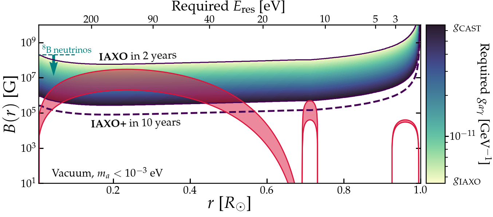
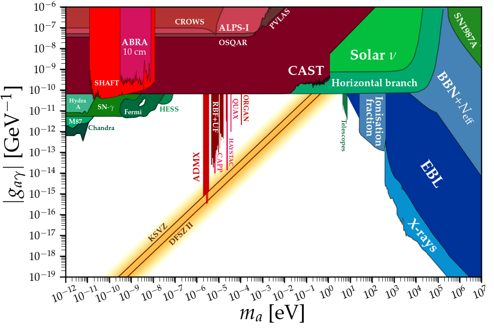
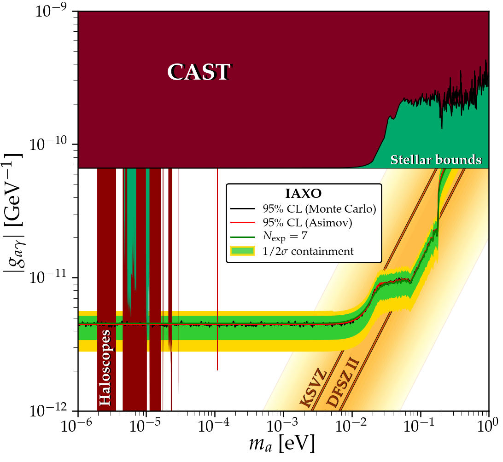
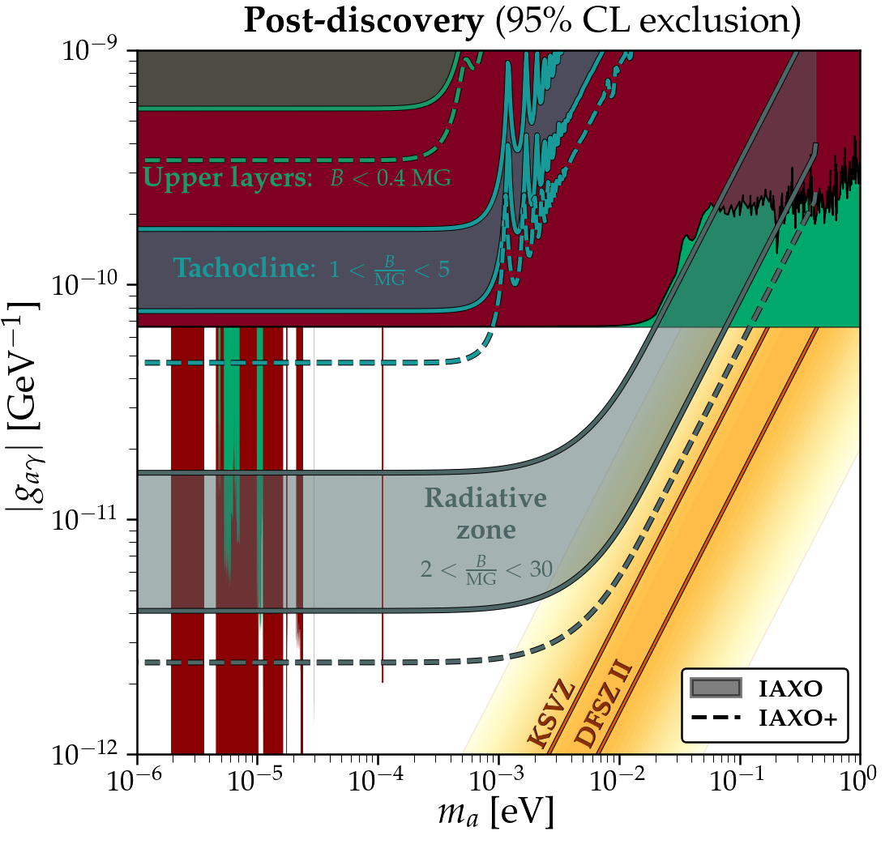

# solax
Python-3 Code to reproduce the results from our paper arXiv:[2006.XXXXX] "Axion helioscopes as solar magnetometers"

If all you need is the data for the longitudinal plasmon flux for our benchmark seismic solar magnetic field model then [click here](https://github.com/cajohare/solax/raw/master/data/solar/LPlasmonFlux_SeismicB.txt). If you want the refined Primakoff flux data then [click here](https://github.com/cajohare/solax/raw/master/data/solar/PrimakoffFlux_PlasmonCorrected.txt)

If you need any assistance or have any questions contact me at ciaran.aj.ohare@gmail.com

# Less common requirements:
* [`iminuit`](https://iminuit.readthedocs.io/en/latest/)
* [`astropy`](https://www.astropy.org/)
* [`cmocean`](https://matplotlib.org/cmocean/)
* [`numba`](http://numba.pydata.org/)

# Contents
* `data/` - Contains various data files, fluxes, solar models and axion limit data
* `src/` - Main python functions for doing the meat of the analysis
* `notebooks/` - for plotting and doing some extra analysis not found in the main paper
* `plots/` - Plots in pdf or png format

# Examples:
Click to go to the notebook used to make the plot

---
